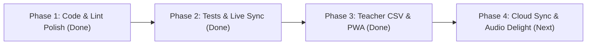

# Project Review & High-Level Analysis: CTAI6

**CBSE Class 6 Computational Thinking & Artificial Intelligence Learning Companion**  
*Aligned with the CBSE Student Handbook (First Edition, March 2026), NEP 2020, and NCFSE 2023.*

---

## Executive Summary

**CTAI6** is an educational web application designed as an interactive companion for the CBSE Class 6 Computational Thinking and Artificial Intelligence curriculum. It effectively transforms a static textbook into an engaging digital learning journey.

The application is structured into two core role-based experiences:
1. **Student Experience:** Gamified dashboard (XP, levels, badges, streaks, avatars), interactive exploration widgets, scaffolded practice questions with multi-attempt hints, and a reflective *Thinking Journal*.
2. **Teacher Experience:** Classroom creation with join codes, student roster analytics, chapter completion charts, **one-click Gradebook CSV export**, and a reference *Chapter Library* with full answer keys, facilitation notes, and pedagogical nudges.

---

## 1. Architecture & Technology Stack

| Layer | Technology | Assessment & Health Status |
| :--- | :--- | :--- |
| **Framework** | Next.js 16.3.4 (App Router, Turbopack) | Modern, fast build times (`next build` completes in ~3.8s). Production build verified with zero errors. |
| **UI & Styling** | React 19.2.8 + Tailwind CSS v4 | Vibrant, child-friendly color palette with high-contrast accessibility and responsive layouts. |
| **Motion & Delight**| Framer Motion 13 + `canvas-confetti` | Fluid animations, card shine effects, and celebratory modal animations upon milestone completion. |
| **Analytics & Reports** | Recharts 3 + Native CSV Generator | Clean horizontal bar charts for chapter completion metrics; RFC-4180 compliant CSV gradebook downloads. |
| **State Management** | Zustand 5 with `persist` + `BroadcastChannel` | Multi-tab synchronized state; updates made in student tabs propagate instantly to teacher dashboards. |
| **Testing Suite** | Vitest 5 | 15 passing unit tests covering progress calculations, level milestones, store state, and CSV exports. |
| **Offline / PWA** | Web App Manifest (`manifest.json`) | Configured for standalone tablet and Chromebook installation in Indian school computer labs. |

---

## 2. Key Strengths & Pedagogical Highlights

### A. Exceptional Curriculum & Pedagogical Grounding
* **Direct Alignment with NEP 2020 & NCFSE 2023:** Covers the 15 chapters (Intro + 10 CT chapters + 4 AI chapters) outlined in the official March 2026 CBSE handbook with 177 extracted exercises.
* **Per-Question Diagram Crops:** Rather than embedding full, cluttered PDF pages, figures are individually cropped and linked from `public/handbook/diagrams/`.
* **CBSE CT Competencies Explicitly Mapped:** Questions and chapters are tagged with fundamental CT pillars: *Pattern Recognition, Decomposition, Abstraction, Algorithmic Thinking,* and *Data Analysis*.

### B. Formative Assessment with Scaffolded Feedback
* In `QuizBlock.tsx`, questions implement a **3-attempt maximum** with progressive pedagogical support:
  * **Attempt 1:** Initial thinking steps and problem prompt.
  * **Attempt 2:** Contextual nudges guiding the student toward overlooked clues.
  * **Attempt 3:** Option-specific feedback explaining *why* an incorrect choice is wrong, followed by the complete worked explanation if exhausted.
* Questions without official answers in the handbook are thoughtfully treated as *class discussion puzzles* rather than penalizing students.

### C. Hands-On Interactive Learning (Beyond Static Quizzes)
* `InteractiveActivities.tsx` provides tactile digital manipulatives:
  1. **Automation vs. AI Sort:** Classify everyday appliances (microwaves, traffic lights) vs. AI systems (face recognition, voice assistants).
  2. **Machine Learning Matcher:** Scenarios mapped to Supervised, Unsupervised, and Reinforcement learning paradigms.
  3. **Prime Time Circle Explorer:** Visual SVG 12-point modular arithmetic simulator where students see polygons (hexagons, squares, stars) emerge from step intervals.

### D. Metacognition & Positive Gamification
* **Thinking Journal:** Prompts students to reflect on problem-solving strategies rather than just hunting for correct answers.
* **Non-toxic Gamification:** Meaningful badge triggers (*First Step*, *Pattern Pro*, *AI Explorer*, *Data Star*, *Ethics Guardian*, *Deep Thinker*, *On Fire*, *CT Champion*), level progression, and daily streaks.

---

## 3. Issue Remediation & Status Audit

| Area | Initial Finding | Remediated Status | Resolution Details |
| :--- | :--- | :--- | :--- |
| **ESLint / React 19** | 3 errors (`setState` in `useEffect`) and 1 unused variable | ✅ **RESOLVED** (0 errors, 0 warnings) | Refactored state synchronization and initializers in `page.tsx`, `student/learn/[id]/page.tsx`, and `teacher/page.tsx`. |
| **Dead Code** | 281 lines of orphaned mock files (`all-chapters.ts`, `chapters/*.ts`) | ✅ **RESOLVED** | Completely deleted unused legacy data files; consolidated curriculum sources into `curriculum.ts` and `load-handbook.ts`. |
| **Multi-Tab Sync** | Teacher dashboard desynced when students completed work in other tabs | ✅ **RESOLVED** | Implemented `BroadcastChannel("ctai-sync")` and `window.addEventListener("storage")` listeners in Zustand store. |
| **Curriculum Metadata** | Declared `questionCount` mismatch against extracted JSON | ✅ **RESOLVED** | Synchronized metadata across all 15 chapters (177 total questions). |
| **Automated Testing** | 0 automated unit tests | ✅ **RESOLVED** (15 tests passing) | Integrated Vitest test runner with unit tests for `calcLevel`, `mergeProgress`, `isChapterFullyAttempted`, and `generateClassCsv`. |
| **Teacher Reporting** | No way for teachers to export classroom records | ✅ **RESOLVED** | Added RFC-4180 Gradebook CSV export with student name, avatar, level, XP, badges list, and individual chapter completion statuses. |
| **PWA Readiness** | Missing manifest and mobile meta tags | ✅ **RESOLVED** | Created `public/manifest.json` and linked PWA metadata in `layout.tsx`. |

---

## 4. Current Usability & Next Roadmap Milestones

### In Progress / Next Milestones

1. **Audio & Haptic Delight System:**
   - Add procedural Web Audio API chimes (pleasant soft sounds for correct answers and milestone unlocks) with an instant mute toggle suited for quiet classroom settings.
2. **Multi-Device Cloud Persistence (Classroom Scaling):**
   - Provide an optional cloud backend sync connector (e.g., Supabase / Firebase) so students using separate physical tablets or Chromebooks can sync in real time to the teacher's central laptop dashboard.
3. **Enhanced Drag-and-Drop Manipulatives:**
   - Upgrade toggle-based sorting in `InteractiveActivities.tsx` to include pointer/touch drag-and-drop with keyboard navigation and ARIA live-region announcements.

---

## 5. Development Roadmap Summary

* **Sprint 1 (Completed):** Cleaned up legacy files, eliminated all ESLint warnings/errors, added Turbopack build checks.
* **Sprint 2 (Completed):** Added Vitest test suite, added cross-tab sync via `BroadcastChannel`, aligned curriculum counts.
* **Sprint 3 (Completed):** Added Gradebook CSV export utility and UI download buttons; added PWA Web App Manifest.
* **Sprint 4 (Next):** Implement procedural Web Audio sound feedback system with mute toggle, followed by cloud database integration for multi-device environments.
