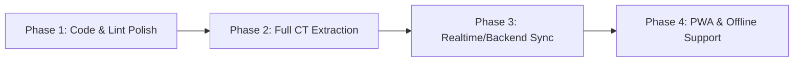

# Project Review & High-Level Analysis: CTAI6

**CBSE Class 6 Computational Thinking & Artificial Intelligence Learning Companion**  
*Aligned with the CBSE Student Handbook (First Edition, March 2026), NEP 2020, and NCFSE 2023.*

---

## Executive Summary

**CTAI6** is an educational web application designed as an interactive companion for the CBSE Class 6 Computational Thinking and Artificial Intelligence curriculum. It effectively transforms a static textbook into an engaging digital learning journey.

The application is structured into two core role-based experiences:
1. **Student Experience:** Gamified dashboard (XP, levels, badges, streaks, avatars), interactive exploration widgets, scaffolded practice questions with multi-attempt hints, and a reflective *Thinking Journal*.
2. **Teacher Experience:** Classroom creation with join codes, student roster analytics, chapter completion charts, and a reference *Chapter Library* with full answer keys, facilitation notes, and pedagogical nudges.

Overall, **the project demonstrates high pedagogical maturity and modern UI design**, but is currently a **client-side prototype** reliant on browser `localStorage`, with specific code hygiene, state synchronization, and curriculum coverage gaps to address before real classroom deployment.

---

## 1. Architecture & Technology Stack

| Layer | Technology | Assessment |
| :--- | :--- | :--- |
| **Framework** | Next.js 16.3.4 (App Router, Turbopack) | Modern, fast build times (`next build` completes in ~4.2s). |
| **UI & Styling** | React 19.2.8 + Tailwind CSS v4 | Vibrant, child-friendly color palette with good typography. |
| **Motion & Delight**| Framer Motion 13 + `canvas-confetti` | Fluid animations, card shine effects, and achievement celebrations. |
| **Analytics** | Recharts 3 | Clean horizontal bar charts for teacher chapter completion metrics. |
| **State Management** | Zustand 5 with `persist` middleware | Single-store architecture persisted to browser `localStorage`. |
| **Data Extraction** | Python (PyMuPDF / `fitz`) | High-utility custom scripts for cropping diagrams directly from `CTAI.pdf`. |

---

## 2. Key Strengths & Pedagogical Highlights

### A. Exceptional Curriculum & Pedagogical Grounding
* **Direct Alignment with NEP 2020 & NCFSE 2023:** Covers the 15 chapters (Intro + 10 CT chapters + 4 AI chapters) outlined in the official March 2026 CBSE handbook.
* **Per-Question Diagram Crops:** Rather than embedding full, cluttered PDF pages, `scripts/extract-diagrams.py` automatically crops 69 question-specific figures from `CTAI.pdf` into `public/handbook/diagrams/`.
* **CBSE CT Competencies Explicitly Mapped:** Questions and chapters are tagged with fundamental CT pillars: *Pattern Recognition, Decomposition, Abstraction, Algorithmic Thinking,* and *Data Analysis*.

### B. Formative Assessment with Scaffolded Feedback
* In `QuizBlock.tsx`, questions implement a **3-attempt maximum** with progressive pedagogical support:
  * **Attempt 1:** Initial thinking steps and problem prompt.
  * **Attempt 2:** Contextual nudges guiding the student toward overlooked clues.
  * **Attempt 3:** Option-specific feedback explaining *why* an incorrect choice is wrong, followed by the complete worked explanation if exhausted.
* Questions without official answers in the handbook are thoughtfully treated as *class discussion puzzles* rather than penalizing students.

### C. Hands-On Interactive Learning (Beyond Static Quizzes)
* `InteractiveActivities.tsx` provides tactile digital manipulatives:
  1. **Automation vs. AI Sort:** Drag/sort everyday appliances (microwaves, traffic lights) vs. AI systems (face recognition, voice assistants).
  2. **Machine Learning Matcher:** Scenarios mapped to Supervised, Unsupervised, and Reinforcement learning paradigms.
  3. **Prime Time Circle Explorer:** Visual SVG 12-point modular arithmetic simulator where students see polygons (hexagons, squares, stars) emerge from step intervals.

### D. Metacognition & Positive Gamification
* **Thinking Journal:** Prompts students to reflect on problem-solving strategies rather than just hunting for correct answers.
* **Non-toxic Gamification:** Meaningful badge triggers (e.g., *First Step*, *Pattern Pro*, *AI Explorer*, *Ethics Guardian*, *Deep Thinker*), level progression, and daily streaks.

---

## 3. High-Priority Issues & Technical Findings

### 1. State Sync & LocalStorage Collision (Critical)
> [!WARNING]
> The current persistence model stores both teacher and student profiles in the same browser's `localStorage` under `ctai-learn-storage`.

* **The Incognito Fallacy:** `web/README.md` instructs users to test the demo by opening student mode in an *incognito tab*. However, browser incognito profiles have isolated storage; a student in incognito will **never** appear in the teacher's dashboard.
* **Cross-Tab Race Condition:** Opening the app as a Teacher in Tab 1 and as a Student in Tab 2 within the same standard profile causes `role` and active user collisions in Zustand.
* **Lack of Real-time Reactivity:** There is no `window.addEventListener('storage', ...)` or `BroadcastChannel` listener. If a student completes an exercise in another tab, the teacher dashboard requires a manual page reload to reflect the update.
* **Classroom Viability:** Without a cloud database (e.g., Supabase, Firebase, or PostgreSQL), the application cannot be used across multiple physical devices (e.g., student tablets + teacher laptop).

### 2. Linting & React 19 Build Failures
Running `npm run lint` fails with **3 errors and 1 warning**:
* **Synchronous `setState` in `useEffect`:**
  * `src/app/page.tsx:25` (`setHydrated(true)`)
  * `src/app/student/learn/[id]/page.tsx:53` (`setTab(...)`)
  * `src/app/teacher/page.tsx:30` (`setSelectedClass(...)`)
  * *Impact:* React 19 / ESLint flags these as cascading re-renders. These can be avoided by deriving initial state or utilizing layout effects / state initializers.
* **Unused Variable:** `src/app/teacher/page.tsx:35` declares `room` which is never read.

### 3. Orphaned / Dead Code
* `src/data/all-chapters.ts` (281 lines) and the entire `src/data/chapters/` directory (`ai-intro.ts`, `ct-patterns.ts`, `intro-start.ts`) are **completely unused**. 
* The production app reads from `load-handbook.ts` and `handbook-extracted.json`. Leaving old mock files creates confusion during future refactoring.
* Duplicate `cn()` helper: Defined globally in `src/lib/utils.ts`, but re-implemented locally inside `InteractiveActivities.tsx`.

### 4. Incomplete CT Question Extraction vs Curriculum Metadata
In `curriculum.ts`, almost all CT chapters declare `questionCount: 10`, but `handbook-extracted.json` contains fewer questions for several units:
* *Data Handling and Presentation:* 3 questions extracted (declared 10)
* *Perimeter and Area:* 4 questions extracted (declared 10)
* *Playing with Constructions:* 3 questions extracted (declared 10)
* *Symmetry:* 6 questions extracted (declared 9)
* *The Other Side of Zero:* 6 questions extracted (declared 9)

*(Note: AI Chapters 1–4 are 100% complete with 96 exercises total).*

### 5. Absence of Automated Testing
* There are **0 unit or integration tests** in the project.
* Key core logic—XP accumulation, level calculations (`calcLevel`), streak tracking across dates, chapter unlocking (`unlockNext`), and answer evaluation—operates without automated regression tests.

---

## 4. UI/UX & Classroom Usability Recommendations

1. **Accessibility (a11y) for Young Learners:**
   * In `InteractiveActivities.tsx`, sorting items uses small toggle buttons ("Automation" / "AI"). Adding drag-and-drop (e.g. `@hello-pangea/dnd`) with accessible ARIA live-announcements would significantly improve engagement and screen-reader support.
   * Add high-contrast mode or toggleable font size adjustments suited for classroom projection screens.
2. **Sound & Haptic Delight:**
   * Gamified learning thrives on gentle audio feedback (success chimes, level-up sound effects). Consider adding optional Web Audio cues with an explicit mute button for quiet classrooms.
3. **Teacher Export & Reporting:**
   * Teachers frequently need to submit assessment records. Adding a simple **"Export Class CSV"** button on the teacher dashboard to download student names, XP, badges, and chapter completion percentages would deliver immense real-world value.
4. **Offline / PWA Support:**
   * Indian school computer labs often have intermittent internet connectivity. Because all questions and diagrams are static assets, configuring Next.js as a Progressive Web App (PWA) with service-worker caching would allow the entire handbook companion to run offline.

---

## 5. Suggested Next Steps

1. **Immediate (Sprint 1):**
   - Resolve the 3 ESLint `setState` errors in `page.tsx`, `student/learn/[id]/page.tsx`, and `teacher/page.tsx`.
   - Delete unused legacy files (`all-chapters.ts`, `src/data/chapters/`).
   - Add `BroadcastChannel` or `storage` event listeners to enable live sync across open tabs in the same browser.
2. **Short-Term (Sprint 2):**
   - Complete extraction of missing CT questions from `CTAI.pdf` into `handbook-extracted.json` to reach full 10-question coverage per chapter.
   - Introduce Vitest + React Testing Library for store logic (`store.ts`) and quiz progression.
3. **Medium-Term (Sprint 3):**
   - Integrate a lightweight cloud backend (Supabase / Firebase / serverless SQLite) for multi-device classroom deployments.
   - Add Class CSV export and PWA offline caching.
